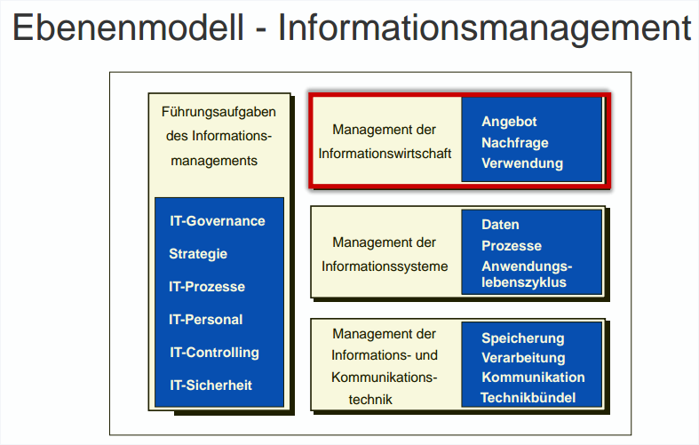
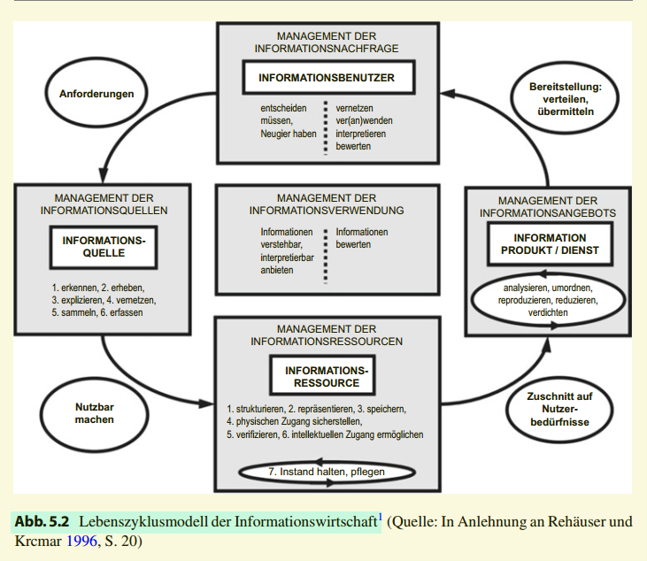
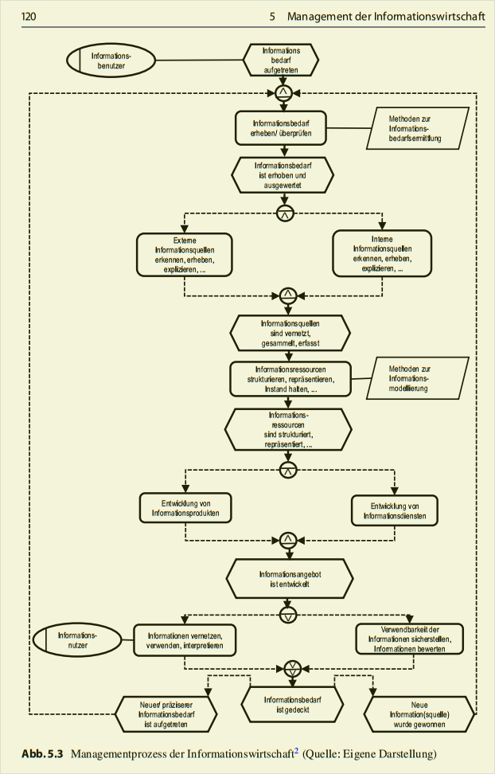

# LE2

## LE2 Lernziele:

* **Lebenszyklus der Informationswirtschaft (IW)** und diesen auf **praktische Anwendungsfälle** übertragen

* die begrifflichen Grundlagen erläutern und unterschiedliche Perspektiven auf **Informationsbedarf**
unterscheiden.

* Methoden, um Informationsbedarf zu ermitteln und die **Methoden KEF und Balanced Scorecard** praktisch anwenden.
---
## 1. Informationswirtschaft im Überblick

### Ziel der Informationswirtschaft
**Herstellung des
informationswirtschaftlichen Gleichgewichts** im Unternehmen 

---

---
## Aufgaben der Informationswirtschaft

* Ausgleich von **Informationsnachfrage und
Informationsangebot**
* Versorgung der **Entscheidungsträger mit relevanten
Informationen**
* Gewährleistung einer hohen **Informationsqualität**
* Dokumentation von **Willensbildungs- und
Willensdurchsetzungsprozessen**
* Gestaltung der Informationswirtschaft als
**Querschnittsfunktion** des Unternehmens
* **Einsatz von IKT** zur Unterstützung der
informationswirtschaftlichen Aufgabenerfüllung
* **Zeitliche Optimierung** der Informationsflüsse
* Beachtung des **Wirtschaftlichkeitsprinzips**

_Die Aufgabe der Informationswirtschaft besteht darin, ein Gleichgewicht zwischen Informationsangebot und Informationsnachfrage herzustellen._

---
## Lebenszyklusmodell der Informationswirtschaft!!!!

_dieses Gleichgewicht dynamisch, d. h. Angebot und Nachfrage von Informationen müssen immer wieder neu aufeinander eingestellt werden. 
Der Managementprozess der Informationswirtschaft gehorcht daher zyklischen Gesetzmäßigkeiten; ändert sich einer der Ausgangsparameter, bspw. die Informationsnachfrage, so wird ein erneuter Durchlauf der Prozessschritte angestoßen._

### Grundlegende Elemente：
1. Management von Informationsnachfrage und -bedarf,
2. Management der Informationsquellen,
3. Management der Informationsressourcen,
4. Management des Informationsangebots,
5. Management der Informationsverwendung und
6. Management der Infrastrukturen der Informationsverarbeitung und Kommunikation

Stehen die im Rahmen eines informationswirtschaftlichen Zyklus erschlossenen Informationen einem Informationsnutzer zur Verfügung, kann Informationsbedarf gedeckt
werden. Der Informationsnutzer interpretiert die von ihm gewünschten Informationen und
die ihm zugegangenen Informationsprodukte und -dienste entsprechend dem von ihm verfolgten Zweck und bringt sie zur Verwendung/Anwendung. Dabei entstehen neue Informationen, da der Informationsnutzer die ihm vom Informationsangebot bereitgestellten
Informationen interpretiert, bewertet und in seine bereits vorhandenen Informationsstrukturen einbindet. Ergebnis dieser Bewertung ist, dass der Informationsbedarf durch das
Informationsangebot befriedigt wurde oder nicht. Dementsprechend muss das Informationsangebot ausgeweitet oder verändert werden.
Die einzelnen Elemente des Lebenszyklusmodells dienen als Gliederungsgrundlage
für die folgenden Unterkapitel. Zunächst wird dabei auf das Management der Informationsnachfrage (Abschn. 5.2) eingegangen. In diesem Kapitel werden zwei Methoden zur
Informationsbedarfserhebung vorgestellt, zum einen die Methode Bestimmung der Kritischen Erfolgsfaktoren und zum anderen die Balanced Scorecard.
Dem Lebenszyklus folgend gliedert sich das Kapitel weiter in das Management der
Informationsquellen (Abschn. 5.3) und das Management der Informationsressourcen
(Abschn. 5.4). In diesem Unterkapitel wird eine Methode zur Informationsmodellierung,
Semantic Web, beschrieben. Danach folgen das Management der Informationsqualität (Abschn. 5.5), das Management des Informationsangebots und der Bereitstellung (Abschn. 5.6) sowie das Management der Verwendung (Abschn. 5.7). In Abschn. 5.8 wird
anhand des hermeneutischen Zirkels die Initiierung weiterer Durchläufe des Lebenszyklus
der Informationswirtschaft dargestellt.
Das Lebenszyklusmodell der Informationswirtschaft bietet einen umfassenden Blick
auf alle Problemstellungen der Informationswirtschaft. Um jedoch den prozessualen Charakter des Managements der Informationswirtschaft hervorzuheben, kann der Lebenszyklus auch anhand eines Managementprozesses verdeutlicht werden. Vorteil ist seine
detailliertere Darstellung. So kann genau aufgezeigt werden, anlässlich welcher Ereignisse die entsprechenden, oben erwähnten Managementaufgaben der Informationswirtschaft
einzusetzen haben. Beispielsweise führt das Ereignis „Informationsbedarf aufgetreten“ zu
der Funktion bzw. Managementaufgabe „Informationsbedarf erheben/überprüfen“. Abbildung 5.3 zeigt den Managementprozess der Informationswirtschaft als Ereignisgesteuerte
Prozesskette
