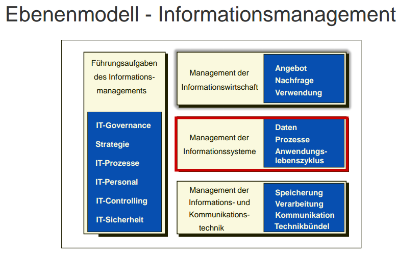
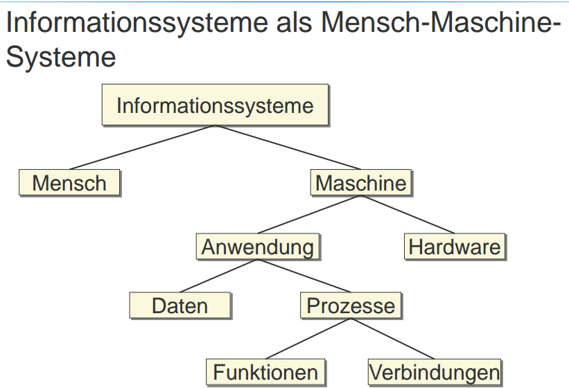
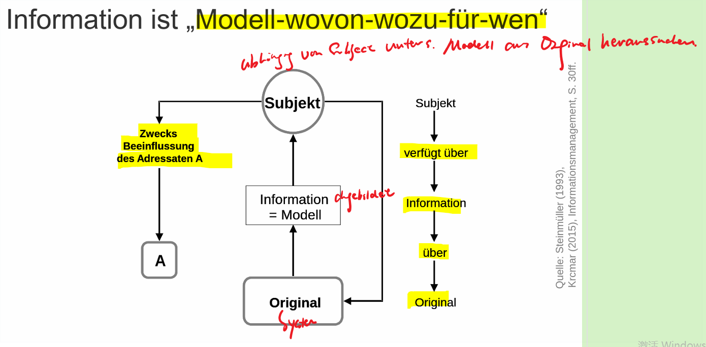
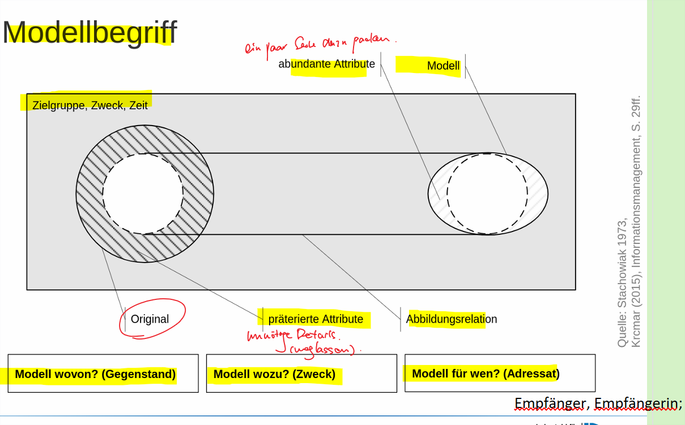
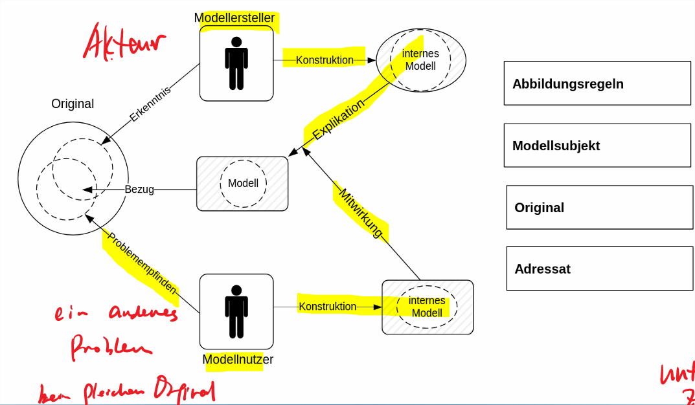

# LE4

## LE4 Lernziele:

* Gegenstandsbereich und die Aufgaben des Managements der Informationssysteme.

* die Begriffe Modell, Referenzmodell und Metamodell erläutern und von einander abgrenzen.

* die Konzepte Datenarchitektur, Datenbanksystem, Datenbanktechnik in die Aufgaben des Datenmanagements
einordnen.

---
## 1. Managementprozess der Informationssysteme

Informationssysteme sind **soziotechnische („Mensch-Maschinen-“)Systeme**, die menschliche und maschinelle Komponenten (Teilsysteme) umfassen und zum **Ziel der
optimalen Bereitstellung von Information und Kommunikation nach wirtschaftlichen Kriterien eingesetzt werden**

**Herausforderungen und Aufgaben des
Managements der Informationssysteme**
* Wie soll das **Management** eines der grundlegenden Bausteine von
Informationssystemen, den **Daten**, gestaltet werden?
* Wie soll das **Management** eines der grundlegenden Bausteine von
Informationssystemen, der **Prozesse**, gestaltet werden?
* Wie wird der **Lebenszyklus** einer einzelnen Anwendung so begleitet, dass
er die **Unternehmensstrategie** sowohl **unterstützt als auch umsetzt**? Wie kann die **gesamte Systemlandschaft** im Unternehmen harmonisch gestaltet
werden?

---
## 2. Modellbegriff

„Modell“ ist stets „Modell-wovon-wozu-für wen“

Modelle sind
* subjektrelativ, da Auswahl des Originals und der Abbildungsregeln auf den Erzeuger zugeschnitten,
* zweckrelativ, da auf Belange des Erzeugers ausgerichtet, und
* perspektivisch, da der Blickwinkel des Erzeugers eingeht

## Modellbegriff

_Danach wird **ein Original mittels einer Abbildungsrelation auf ein Modell abgebildet**. Dies geschieht im
Hinblick auf **Zielgruppe, Zweck und Zeit**. Präterierte (also ausgelassene bzw. übergangene) Attribute des Originals sind solche, die vom Modell nicht abgebildet werden. Auf
der anderen Seite existieren auch **abundante (von lat. abundare: „reichlich vorhanden sein“)** Attribute des Modells._

_Der Modellbegriff beinhaltet daher im Wesentlichen vier Elemente: die Abbildungsregeln, das Modellsubjekt, die abzubildende Realität und den Adressaten der Modellbetrachtung. Abbildungsregeln schreiben vor, wie die Realität abzubilden ist, um Objektivität und Intersubjektivität zu gewährleisten. Das Modellsubjekt ist der Erzeuger eines Modells. Die Realität stellt das Original oder die Vorlage für das zu erstellende Modell dar und der Adressat sollte mit Kenntnis der Abbildungsregeln in der Lage sein, das Modell zu verstehen und richtig zu interpretieren._

## Systemischer Modellbegriff

_Bei der Erstellung eines Modells sind in der Regel sowohl Modellersteller wie auch die späteren Modellnutzer beteiligt. Beide Parteien haben bei der Erstellung des Modells eine eigene Sichtweise auf die Problematik beziehungsweise eine sich unterscheidende Sichtweise auf die für ein Modell relevanten Informationen aus dem Original bzw. der Wirklichkeit. Zudem bereichern beide Parteien für sich das Modell durch abundante Informationen. Der Modellersteller etwa durch sein Fachwissen und der Modellnutzer durch seine Erfahrungen. Sowohl Modellersteller wie auch Modellnutzer gelangen auf diese Weise zu einer eigenen Vorstellung des fertigen Modells. Um zu einem korrekten Ergebnis zu gelangen, gilt es nun für den Modellersteller unter Einbezug des Modellnutzers das fertige Modell zu konstruieren und gegebenenfalls Anpassungen an der eigenen Sichtweise auf die Problematik vorzunehmen. Er bezieht dabei die abundanten Informationen des Modellnutzers mit ein und ergänzt seine eigenen, falls sich deren Relevanz bestätigt. Das Ergebnis dieses Prozesses ist schließlich das fertige Modell, welches sich auf die Schnittmenge der Ansichten beider Beteiligten Gruppen bezieht._

